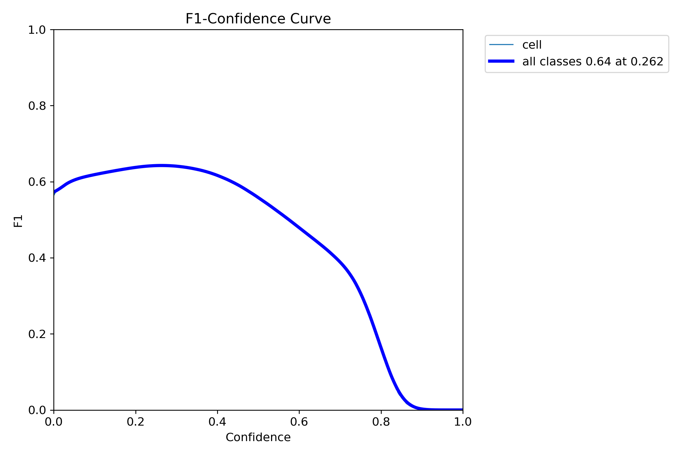
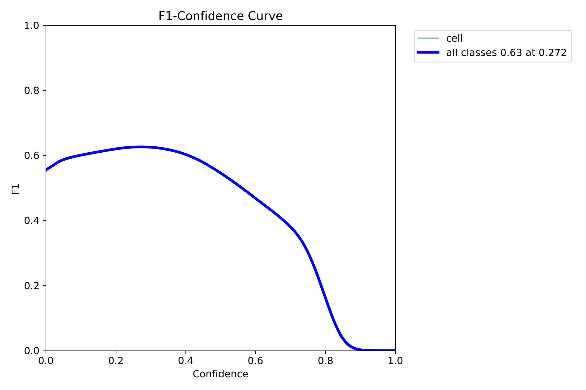

# LIVECell Instance Segmentation with Yolov8


## Introduction
This repo trained a yolov8 model for instance segmentation for [LIVECell Dataset](https://github.com/sartorius-research/LIVECell?tab=readme-ov-file). We trained `Yolov8s-seg` model for 10 epochs. We also deployed the model with `Gradio` on `onnxruntime`.

|  Overall Performance |
|:--------------------:|


|     Box PR curve     |    Mask PR curve     |
|:--------------------:|:--------------------:|
  |  


## Installation
### Install environment
```
git clone https://github.com/impromptuRong/yolo_livecell.git
cd yolo_livecell
conda env create -n yolo_livecell python=3.11
pip3 install --no-cache-dir -r requirements.txt
python app_gradio.py
```
### Download model
The whole checkpoint folder can be downloaded here: [checkpoint folder](https://drive.google.com/drive/folders/1o3ncNcmDpmc-BB8Xdt9cxUdZiKHqBJYE?usp=sharing). The trained pytorch model: [trained_model](https://drive.google.com/file/d/15-avlWF4LDdUEK5BNFfCb5a9j_BStt6G/view?usp=sharing), the inference onnx model: [inference_model](https://drive.google.com/file/d/1owhHZQIj0FWDNRWsEKaTm9gcvQThA7Et/view?usp=sharing).


### Install with docker
```
docker build -t yolo_livecell:latest .
docker run -p 7860:7860 yolo_livecell:latest
```

